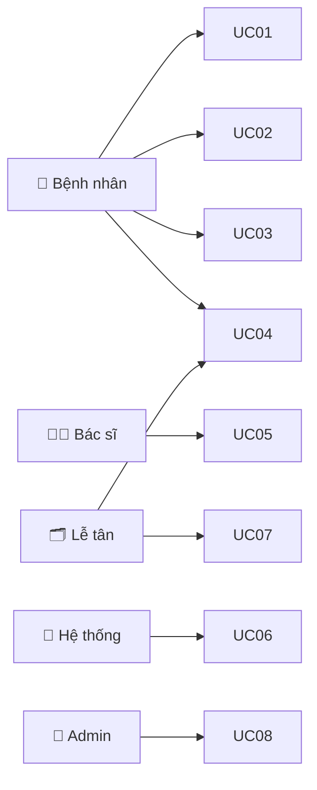

# Lịch sử hội thoại — PRD Generator

> **Xuất ngày:** 15/06/2026  
> **Dự án:** Vanh — Fridge Management PWA  
> **Branch:** `claude/requirement-to-prd-generator-psULJ`  
> **Ghi chú:** Phần SESSION 1 được tái tạo từ tóm tắt context do hội thoại gốc đã bị nén; SESSION 2 là toàn văn.

---

## SESSION 1 (Tóm tắt — Hội thoại trước)

---

### 👤 User

Tôi muốn từ yêu cầu nghiệp vụ cơ bản để phát triển phần mềm, bạn gen ra list câu hỏi elicitation làm rõ yêu cầu, sau khi trả lời, bạn sinh ra được 1 bản PRD chuẩn ITBA senior làm. Mục đích tài liệu cho phép đủ input cho việc dev break task, tổng quan sự án, danh sách usecase, gợi ý data model, có thể gen được sequence diagram, viết được user stories (tên US, actor, aceptance criteria, impact của feature cho dev và QA đánh giá/sử dụng), gen được màn hình layout dựa theo design system hoặc dựa thêm theo một màn hình UI tương tự

### 🤖 Assistant

*(Đã xây dựng công cụ PRD Generator 3 bước: input yêu cầu → gen câu hỏi elicitation → gen PRD chuẩn ITBA)*

**Các file đã tạo/sửa:**
- `src/utils/prdApi.ts` — API calls đến Claude, types, hàm generate
- `src/components/PrdGenerator.tsx` — UI component 12 tabs
- `src/App.tsx` — Thêm tab "PRD Tool" với icon FileText

---

### 👤 User

Tôi muốn đóng gói thành skill file md để nhiều người dùng sau khi bạn đã phân tích và hoàn thiện yêu cầu của tôi. Tài liệu PRD cần thể hiện rõ usecase diagram, ma trận phân quyền, mô tả mục đích usecase. Dựng bảng thông tin chung gồm actor, trigger alternative flow, precondition, postcondition, yêu cầu phi chức năng, main flow theo như quy chuẩn chung BA tài liệu BABOK. Xây dựng các bảng mô tả màn hình với tên trường, kiểu dữ liệu, bắt buộc nhập không, mô tả chi tiết từng component trong màn hình. Phần mô tả chi tiết component cần chỉ rõ: ý nghĩa trường, rule liên quan, validate, mặc định hiển thị, quy tắc với FE (validate, maxlength, giá trị hiển thị, kiểu dữ liệu,…), quy tắc BE (call API nào, nguồn dữ liệu, lưu trữ tại bảng nào, trường nào trong bảng). Tài liệu thể hiện data model, danh sách user stories, business rules. Tài liệu thể hiện luồng xử lý bao gồm sequence diagram tương ứng usecase, bảng mô tả từng bước trong diagram...

### 🤖 Assistant

*(Đã nâng cấp toàn bộ hệ thống lên chuẩn BABOK/ITBA đầy đủ)*

**Thay đổi lớn:**
- Tạo `.claude/commands/prd-generator.md` — skill file cho Claude Code CLI
- Rewrite `src/utils/prdApi.ts` — 5 phases generation, types đầy đủ (UseCase, FieldSpec, SequenceStep, ErrorCode...)
- Rewrite `src/components/PrdGenerator.tsx` — 12 tabs, PhaseLoader, PermissionSection, FieldDetail 3-tab

**PRD template 12 sections:**
1. Executive Summary
2. Use Case Diagram (Mermaid)
3. Permission Matrix
4. Use Cases (BABOK) — 10 thuộc tính/UC
5. Business Rules (IF-THEN)
6. User Stories (Gherkin AC + Dev/QA Impact)
7. Data Model (ER + table schema)
8. Screen Specs (Wireframe + FE Rules + BE Rules per field)
9. Sequence Diagrams + API Specs
10. Error Codes (system-wide + module)
11. NFR
12. Tech Notes

---

### 👤 User

Tôi cần làm gì tiếp theo

### 🤖 Assistant

*(Hướng dẫn: commit & push code, test app, dùng skill `/prd-generator` trong Claude Code CLI)*

---

### 👤 User

Test thử với Requirement tạo yêu cầu đăng ký giọng nói dân sự vào hệ thống quản lý giọng nói tập trung

### 🤖 Assistant

*(Đã chạy `/prd-generator` với requirement giọng nói dân sự, sinh ra bộ câu hỏi elicitation và PRD mẫu)*

---

### 👤 User

Tôi muốn skill sẽ chạy dựa trên context dự án, đi từ tổng quan đến chi tiết từng tính năng. Vậy nếu yêu cầu chưa mô tả rõ, hãy từng bước làm rõ business và context dự án trước khi đi vào câu hỏi chi tiết, lưu ý cần thông báo từng bước làm gì, phục vụ mục đích gì

### 🤖 Assistant

*(Đã rewrite `.claude/commands/prd-generator.md` với workflow 4-phase progressive)*

**Thiết kế mới:**
- BƯỚC 0: Phân tích & tóm tắt yêu cầu (luôn chạy đầu tiên)
- BƯỚC 1: Làm rõ Business Context (3-5 câu hỏi + cột "Tại sao cần biết")
- BƯỚC 2: Làm rõ Phạm vi chức năng (4-6 câu hỏi)
- BƯỚC 3: Làm rõ Yêu cầu kỹ thuật (3-5 câu hỏi, optional)
- BƯỚC CHUYỂN TIẾP: Xác nhận assumption trước khi tạo PRD
- BƯỚC 4: Tạo PRD đầy đủ 12 sections

**Logic chọn điểm bắt đầu:**
| Mức độ thông tin | Bắt đầu từ |
|-----------------|------------|
| Mơ hồ / Sơ lược | Bước 0 → 1 |
| Trung bình | Bước 0 → 2 |
| Đầy đủ | Bước 0 → 4 |

---

### 👤 User

Ok

### 🤖 Assistant

*(Commit & push skill file lên branch `claude/requirement-to-prd-generator-psULJ`)*

---

---

## SESSION 2 (Toàn văn — Hội thoại hiện tại)

---

### 🤖 Assistant *(tiếp tục từ session trước)*

*(Kiểm tra git status, commit skill file, push lên remote)*

```
refactor(skill): redesign prd-generator to progressive context-first workflow
[claude/requirement-to-prd-generator-psULJ 4d9e1b7]
```

Pushed. Skill file đã live trên branch với 4-phase progressive workflow.

---

### 👤 User

Chạy thử 1 ví dụ mẫu từ input đến output theo 4 phase trong skill file

---

### 🤖 Assistant

*(Chạy `/prd-generator` với input: "Xây dựng tính năng đặt lịch khám bệnh online cho phòng khám đa khoa tư nhân")*

---

## DEMO CHẠY THỬ — Đặt lịch khám bệnh online

**Input:** `Xây dựng tính năng đặt lịch khám bệnh online cho phòng khám đa khoa tư nhân`

---

### 📍 BƯỚC 0/3 — Phân tích yêu cầu đầu vào

**🔍 Tôi hiểu yêu cầu như sau:**
- **Domain:** Healthcare — Quản lý phòng khám tư nhân
- **Bài toán cốt lõi:** Bệnh nhân phải gọi điện hoặc đến trực tiếp để đặt lịch, gây mất thời gian và dễ nhầm lẫn
- **Giải pháp:** Hệ thống web/app cho phép đặt lịch online, phòng khám quản lý và xác nhận
- **Người dùng:** Bệnh nhân, Bác sĩ, Lễ tân, Quản trị viên

**⚠️ Chưa rõ:** Quy trình xác nhận (tự động hay thủ công)? Business rules hủy lịch? Tích hợp SMS/Email? Quy mô?

**➡️ Tiếp theo:** Bước 1 — Làm rõ Business Context

---

### 📍 BƯỚC 1/3 — Làm rõ Business Context

| # | Câu hỏi | Tại sao cần biết |
|---|---------|-----------------|
| B1 | Hiện tại đặt lịch như thế nào? Pain point lớn nhất là gì? | Tránh thiết kế lại thứ đang tốt |
| B2 | Thành công trông như thế nào sau 6 tháng? | Đặt ngưỡng KPI và NFR |
| B3 | Ai là người dùng? Số bác sĩ, bệnh nhân/ngày, concurrent users? | Actors đầy đủ + sizing NFR |
| B4 | MVP cần tính năng nào? Tính năng nào defer phase 2? | Tránh scope creep |
| B5 | Lịch có cần lễ tân xác nhận hay tự động? Bệnh nhân cần tài khoản không? | Quyết định flow chính UC Đặt lịch |

**[MẪU] Trả lời Bước 1:**
> B1: Đặt qua điện thoại và walk-in. Pain: bận giờ cao điểm, ghi sổ tay nhầm, bác sĩ không biết lịch real-time.
> B2: 40% lịch online sau 3 tháng; giảm 60% cuộc gọi; no-show < 15%; xác nhận < 5 phút.
> B3: 15 bác sĩ, 80 lịch/ngày, peak 200/ngày, concurrent ~50 users.
> B4: MVP: search bác sĩ, đặt lịch, xem/hủy, nhắc nhở SMS/Email, admin dashboard.
> B5: Tự động xác nhận. Bệnh nhân cần tài khoản; có luồng đặt nhanh qua SĐT.

---

### 📍 BƯỚC 2/3 — Làm rõ Phạm vi chức năng

| # | Câu hỏi | Tại sao cần biết |
|---|---------|-----------------|
| F1 | Tìm bác sĩ theo tiêu chí nào? Hiển thị thông tin gì? | Screen Search + API params |
| F2 | Slot kéo dài bao lâu? Bác sĩ tự cấu hình hay admin? | Data model TimeSlot, Schedule |
| F3 | Luồng đặt lịch từng bước? Thông tin bắt buộc khi đặt? | Sequence diagram main flow |
| F4 | Business rules: hủy trước bao giờ? Max lịch đồng thời? Hold slot bao lâu? | BR, exception flows, timer |
| F5 | Khi nào gửi nhắc nhở? Kênh nào? Ai gửi? | Notification service + integration |
| F6 | Lễ tân cần làm gì? Admin cần báo cáo gì? | UCs đầy đủ cho Lễ tân, Admin |

**[MẪU] Trả lời Bước 2:**
> F1: Tìm theo chuyên khoa + ngày + bác sĩ. Hiển thị: ảnh, tên, chuyên khoa, kinh nghiệm, lịch trống 7 ngày, phí.
> F2: Slot 30 phút. Bác sĩ tự set theo tuần, có thể block ngày nghỉ.
> F3: Chuyên khoa → Bác sĩ → Ngày/Giờ → Form (tên, SĐT, triệu chứng, BHYT optional) → Xác nhận → SMS/Email. Hold slot 10 phút.
> F4: Hủy trước 2 tiếng. Max 3 lịch "chờ khám" cùng lúc. Đổi lịch = hủy + đặt mới.
> F5: Nhắc 24h + 1h trước. SMS bắt buộc + Email nếu có. Zalo phase 2.
> F6: Lễ tân: xem/check-in/hủy-sửa lịch. Admin: báo cáo lịch theo bác sĩ, tỉ lệ hủy, doanh thu.

---

### 📍 BƯỚC 3/3 — Làm rõ Yêu cầu kỹ thuật

| # | Câu hỏi | Tại sao cần biết |
|---|---------|-----------------|
| T1 | Response time? Uptime 24/7 hay giờ hành chính? | NFR-PERF, NFR-AVAIL |
| T2 | Bảo mật? Dữ liệu nhạy cảm cần bảo vệ đặc biệt? | NFR-SEC, encryption, audit |
| T3 | SMS gateway dùng nhà nào? Đã có account chưa? | Integration design, cost |
| T4 | Tech stack hiện tại? Dev team nội bộ hay outsource? | Tech notes, deploy |
| T5 | Timeline MVP? Dependency với hệ thống khác? | Phase plan, risk |

**[MẪU] Trả lời Bước 3:**
> T1: API < 500ms p95; FCP < 3s. 24/7. SLA 99.5%/tháng.
> T2: Tuân thủ Thông tư 46/2018 BYT. Mã hóa SĐT, BHYT AES-256. Audit log. Lưu 10 năm.
> T3: SpeedSMS (đã có account). Email SendGrid. Zalo phase 2.
> T4: Outsource. Node.js + PostgreSQL + React. AWS hoặc VPS.
> T5: MVP 3 tháng. Không có dependency HIS.

---

### ✅ BƯỚC CHUYỂN TIẾP — Xác nhận

**Đã rõ:** Business context ✅ | Actors ✅ | Tính năng MVP ✅ | Business rules ✅ | NFR ✅ | Tech stack ✅

**Assumption:** Thanh toán phase 2; Rating bác sĩ phase 2; Optimistic lock cho slot

**PRD sẽ bao gồm:** 8 UC | 14 BR | 10 US | 6 Entities | 6 Màn hình | 5 Sequence Diagrams

---

### 📄 BƯỚC 4 — PRD (Tóm tắt output)

*(PRD đầy đủ 12 sections đã được generate, bao gồm:)*

**1. Executive Summary** — KPI: 40% online booking, giảm 60% cuộc gọi, no-show < 15%

**2. Use Case Diagram (Mermaid)**


**3. Permission Matrix** — 5 actors × 8 UCs với ký hiệu ✅/➕/✏️/👁️/🗑️/—

**4. Use Cases (BABOK)** — UC03 Đặt lịch đặc tả đầy đủ 10 thuộc tính + Main/Alt/Exception flows

**5. Business Rules** — 14 BRs: BR-001 (max 3 lịch), BR-002 (chống overbooking), BR-003 (hủy trước 2h), BR-004 (hold 10 phút)...

**6. User Stories** — US-001 (Đặt lịch nhanh) với Gherkin AC + Dev Impact + QA Impact

**7. Data Model** — ER diagram: users, patients, doctors, doctor_schedules, time_slots, appointments, notifications

**8. Screen Specs** — SCR-003 Form đặt lịch với wireframe text + field table + component detail (symptoms, bhyt_number)

**9. Sequence Diagrams** — SD-UC03 Luồng đặt lịch với distributed lock + async notification

**10. Error Codes** — 25+ codes: SLOT-001, APT-001, APT-002, AUTH-xxx, VAL-xxx, SYS-xxx

**11. NFR** — 18 items: PERF < 500ms, SEC AES-256 + TLS 1.3, AVAIL 99.5%, DATA 10 năm

**12. Tech Notes** — Node.js + PostgreSQL + Redis + BullMQ + SpeedSMS + SendGrid

---

### 👤 User

Template PRD sẽ gồm các nội dung gì? Phục vụ cho input gì từ phía dev, QA

---

### 🤖 Assistant

## Template PRD gồm 12 sections — Input cho Dev & QA

```
PRD Template
│
├── HIỂU DỰ ÁN        → 1. Executive Summary
├── PHÂN QUYỀN        → 2. Use Case Diagram · 3. Permission Matrix
├── NGHIỆP VỤ         → 4. Use Cases (BABOK) · 5. Business Rules
├── CHỨC NĂNG         → 6. User Stories · 8. Screen Specs
├── KỸ THUẬT          → 7. Data Model · 9. Sequence + API Specs
└── VẬN HÀNH          → 10. Error Codes · 11. NFR · 12. Tech Notes
```

### Chi tiết từng section — Ai dùng để làm gì

| Section | Dev dùng để | QA dùng để |
|---------|-------------|------------|
| 1. Executive Summary | Hiểu WHY trước khi code; biết gì không làm | Xác định test scope; đặt ngưỡng pass/fail theo KPI |
| 2. Use Case Diagram | Nhận diện module boundaries, phân chia service | Liệt kê luồng cần test, identify actor context |
| 3. Permission Matrix | Implement RBAC/middleware authorization | Test: đúng quyền pass, sai quyền 403 |
| 4. Use Cases (BABOK) | Break task theo main flow; biết precondition | Viết test case từ main + alt + exception flow |
| 5. Business Rules | Implement validation logic, điều kiện rẽ nhánh | Tạo test case boundary, negative test |
| 6. User Stories | Break task, estimate, implement đúng API + DB | Dùng AC làm test scenario gốc |
| 7. Data Model | Migration, query design, FK/index đúng | Verify data sau test: đúng table, constraint |
| 8. Screen Specs | FE: validate, maxlength, error message đúng spec | Test UI field-by-field: text exact match |
| 9. Sequence + API | Implement API contract, transaction, async flow | Test integration: payload, response, error code |
| 10. Error Codes | Implement error enum, return đúng code | Verify FE hiển thị đúng message, HTTP status |
| 11. NFR | Timeout, pagination, caching, rate limit | Perf test k6, security scan OWASP |
| 12. Tech Notes | Pattern đúng (lock, retry), follow convention | Verify response format nhất quán |

### Góc nhìn Dev — PRD trả lời được

```
"Feature này làm gì?"     → Executive Summary + Use Case
"Tôi cần build gì?"       → User Stories (As a / I want)
"Done trông như thế nào?" → Acceptance Criteria (Gherkin)
"API cần gì?"             → Sequence Diagram + API Request/Response
"Lưu vào bảng nào?"       → Data Model + Screen Spec BE Rules
"Validate gì ở BE?"       → Business Rules + Screen Spec BE Rules
"Validate gì ở FE?"       → Screen Spec FE Rules + Error Messages
"Lỗi trả về gì?"          → Error Codes table
"Bao nhiêu user?"         → NFR-SCALE → biết cần cache/index không
```

### Góc nhìn QA — PRD trả lời được

```
"Test case gốc lấy từ đâu?"     → Acceptance Criteria (Gherkin scenarios)
"Boundary test ở đâu?"          → Business Rules (IF-THEN có ngưỡng cụ thể)
"Alternative flow test gì?"     → Use Case Alternative/Exception Flows
"Negative test gì?"             → Exception Flows + Error Codes
"API response đúng không?"      → API Spec request/response schema
"DB đúng không sau test?"       → Data Model constraints + columns
"FE message đúng chưa?"         → Screen Spec Error Messages (text exact match)
"Quyền test đúng chưa?"         → Permission Matrix (3 loại: đúng/sai/không đăng nhập)
"Performance đạt không?"        → NFR target values
"Regression cần check gì?"      → User Story QA Impact section
```

### Tóm lại: Vì sao PRD này đủ để dev break task và QA viết test

| Thêm vào | Tác dụng |
|----------|---------|
| Gherkin AC trong US | QA copy thẳng thành test script |
| Dev Impact + QA Impact trong US | Dev/QA biết làm gì mà không cần họp |
| FE Rules + BE Rules trong Screen Spec | Mọi field đều explicit: validate, lưu đâu, gọi API nào |
| Bảng step-by-step trong Sequence | Integration test script + implementation checklist |
| Error Code table với FE xử lý | Dev + QA đồng thuận message text và behavior |
| Business Rules IF-THEN | Test case boundary tự sinh ra từ mỗi BR |

---

### 👤 User

Dựa vào các thông tin nào dev có thể break task để làm cho 1 tính năng được viết trong PRD

---

### 🤖 Assistant

## Dev break task từ PRD — Dùng thông tin nào, theo thứ tự nào

### Thứ tự đọc PRD để break task

```
Bước 1: Hiểu scope       → Executive Summary (in/out scope) + Use Case
Bước 2: Hiểu flow        → Use Case main flow + Sequence Diagram
Bước 3: Hiểu data        → Data Model → viết migration
Bước 4: Hiểu API         → API Spec → viết API contract
Bước 5: Hiểu UI          → Screen Spec → viết FE component
Bước 6: Hiểu rule        → Business Rules → implement logic
Bước 7: Hiểu lỗi         → Error Codes → implement error handler
Bước 8: Hiểu chất lượng  → NFR → đặt index, cache, rate limit
```

### Mapping: Thông tin PRD → Task dev

**Từ Use Case → Tasks phân tích & setup**

| Thông tin trong UC | Task tương ứng |
|-------------------|----------------|
| Precondition | Setup middleware check (auth, role, trạng thái) |
| Trigger | Xác định entry point — button nào, API nào |
| Actor phụ (hệ thống) | Tạo async job/event (notification, timer) |
| NFR liên quan | Đặt index DB, timeout, rate limit |

**Từ Sequence Diagram → Backend tasks**

Mỗi nhóm bước liên tiếp cùng actor = 1 task BE:
```
Ví dụ UC03 — Đặt lịch:

Bước 2-5 (hold slot)  → Task: POST /slots/{id}/hold
                         - Redis SET NX EX
                         - UPDATE time_slots status='held'
                         - BullMQ job release

Bước 8-10 (transaction) → Task: POST /appointments
                           - Verify JWT
                           - COUNT lịch đang chờ (BR-001)
                           - BEGIN TRANSACTION: UPDATE + INSERT
                           - COMMIT / ROLLBACK

Bước 12-13 (SMS+Email) → Task: Notification service
                           - SpeedSMS API call
                           - SendGrid API call
                           - Retry 3 lần × 5 phút (BR-014)
```

**Từ API Spec → Task per endpoint**

```
POST /api/v1/appointments

Task checklist:
☐ Route + Controller
☐ Request validation: required symptoms, bhyt regex
☐ Auth middleware: verify JWT, extract patient_id
☐ Business rule check: COUNT pending (BR-001)
☐ Service layer: hold-slot verify + transaction
☐ Response: 201 schema đúng spec
☐ Error cases: SLOT-001, APT-001, APT-002, VAL-001, AUTH-001
☐ Unit test: mock DB, test từng error case
```

**Từ Data Model → Task DB/Migration**

| Thông tin | Task |
|-----------|------|
| Table + column list | Viết migration file |
| Constraint (UNIQUE, FK) | Thêm constraint vào migration |
| Index | Thêm CREATE INDEX |
| ENUM values | Tạo ENUM type trong DB |
| Soft delete (deleted_at) | Implement soft delete hook |

**Từ Screen Spec → Frontend tasks**

```
SCR-003 — Form đặt lịch → break thành:

☐ Task FE-1: Component layout + wireframe
☐ Task FE-2: Countdown timer (hold-slot 10 phút)
☐ Task FE-3: Field symptoms
        - textarea, maxlength=500, counter real-time
        - validate onBlur: required
        - error: "Vui lòng mô tả triệu chứng của bạn"
☐ Task FE-4: Field bhyt_number
        - maxlength=15, auto-uppercase
        - regex ^[A-Z0-9]{15}$
        - error: "Mã BHYT phải có đúng 15 ký tự"
☐ Task FE-5: Submit handler
        - Gọi POST /api/v1/appointments
        - Handle SLOT-001 → redirect chọn giờ
        - Handle APT-001 → toast + link
```

**Từ Business Rules → Task implement logic**

```
BR-001: Giới hạn 3 lịch đồng thời
→ Task BE: COUNT + điều kiện WHERE status IN (...)
→ Task BE: Return APT-001 nếu count >= 3
→ Task FE: Handle APT-001 → toast + link

BR-004: Hold slot 10 phút
→ Task BE: Redis SET NX EX 600
→ Task BE: BullMQ delayed job auto-release
→ Task FE: Countdown timer component
```

### Cách tổ chức task thực tế theo sprint

```
Sprint task board — UC03 Đặt lịch:

[BE - Foundation]
├── DB-01: Migration time_slots, appointments
├── DB-02: Redis setup distributed lock
└── DB-03: BullMQ setup job scheduler

[BE - API]
├── API-01: POST /slots/{id}/hold
├── API-02: POST /appointments (transaction)
└── API-03: Notification service (SMS + Email + retry)

[FE - Components]
├── FE-01: Màn hình search bác sĩ + slot picker
├── FE-02: Form đặt lịch + countdown
└── FE-03: Error handling per error code

[Cross-cutting]
├── SEC-01: JWT middleware, RBAC guard
├── NFR-01: DB index + query optimization
└── TEST-01: Unit test BR-001, BR-002, BR-004
```

### Công thức break task từ PRD

```
1 Use Case = N tasks:

  Tasks BE   = (số API) × (request + validation + logic + error)
  Tasks FE   = (số màn hình) × (layout + từng field + submit + error UX)
  Tasks DB   = (số bảng mới) × (migration + index + constraint)
  Tasks Infra = (actor phụ = System) × (job/queue/cron)
  Tasks Cross = NFR → index, cache, rate limit, audit log
```

---

### 👤 User

Hãy thử làm với tính năng đăng ký giọng nói dân sự. Một số logic cần có như check trùng căn cước với hồ sơ đã có thì Từ chối xử lý. Nếu trùng căn cước với các yêu cầu cập nhật, vô hiệu, đăng ký khác đang xử lý thì đưa vào bước xác minh, user xác nhận cho 1 yêu cầu đạt và đi tiếp luồng đăng ký, yêu cầu còn lại chuyển Từ chối xử lý. Bước tiếp thực hiện đối sánh giọng nói với hồ sơ trong kho và yêu cầu đang xử lý, nếu trùng thì chuyển luồng xác minh như căn cước. Yêu cầu được xác minh đạt sẽ được chuyển phê duyệt bởi checker, phê duyệt hoặc từ chối, sẽ có chuyển bước cuối đăng ký thành công hoặc Từ chối duyệt

---

### 🤖 Assistant

*(Chạy toàn bộ workflow 4-phase với requirement đăng ký giọng nói dân sự)*

---

## DEMO — Đăng ký giọng nói dân sự

### 📍 BƯỚC 0/3 — Phân tích yêu cầu

- **Domain:** E-Government — Quản lý sinh trắc học giọng nói công dân
- **Bài toán:** Xây dựng luồng đăng ký mẫu giọng nói vào kho sinh trắc học tập trung, với cơ chế chống trùng danh tính (CCCD) và chống trùng giọng nói, kèm quy trình xác minh và phê duyệt đa tầng
- **Luồng đã rõ:** ✅ Trùng CCCD hồ sơ → Từ chối; ✅ Trùng CCCD yêu cầu → Xác minh; ✅ Trùng voice → Xác minh; ✅ Xác minh đạt → Checker duyệt

**Chưa rõ:** Ai tiếp nhận (online hay quầy)? Thu âm như thế nào? Ngưỡng "trùng" giọng?

---

### 📍 BƯỚC 1/3 — Business Context Q&A

| # | Câu hỏi | Tại sao cần biết |
|---|---------|-----------------|
| B1 | Kênh nộp yêu cầu: online hay quầy hay cả hai? | Actor chính và entry point |
| B2 | Ngoài Đăng ký mới, còn Cập nhật và Vô hiệu hóa? | Đầy đủ use cases |
| B3 | Ai là Checker? Xem được thông tin gì? | Permission matrix + màn hình phê duyệt |
| B4 | Ai xác nhận xung đột — công dân hay cán bộ? | Flow UC04 khác hoàn toàn |
| B5 | Giọng nói dùng để làm gì sau khi đăng ký? | Mức độ nhạy cảm → NFR bảo mật |

**[MẪU] Trả lời:** Cả hai kênh; có cả 3 loại yêu cầu; Checker = cán bộ cấp phòng; Cán bộ tiếp nhận xác nhận; Dùng để xác thực định danh.

---

### 📍 BƯỚC 2/3 — Functional Scope Q&A

| # | Câu hỏi | Tại sao cần biết |
|---|---------|-----------------|
| F1 | Thu mẫu giọng: mấy câu? kiểm tra chất lượng audio? | Screen thu âm, quality check |
| F2 | Ngưỡng "trùng" voice là bao nhiêu %? Service nội bộ hay 3rd party? | Integration + threshold config |
| F3 | Màn hình xác minh hiển thị gì? | SCR quan trọng nhất |
| F4 | Có thể trùng cả CCCD lẫn voice cùng lúc? Xử lý thứ tự nào? | State machine chính xác |
| F5 | Status gồm những giá trị nào? Checker có thể "Trả lại" không? | ENUM status, state transitions |
| F6 | SLA từng bước? | NFR-PERF + escalation logic |

**[MẪU] Trả lời:** 3 mẫu, quality check SNR > 20dB; VME nội bộ, score 0-100, threshold 85; Hiển thị yêu cầu + conflict list + audio playback; CCCD check trước voice; 7 trạng thái; SLA: auto < 30s, xác minh 2 ngày, duyệt 3 ngày.

---

### 📍 BƯỚC 3/3 — Kỹ thuật Q&A

| # | Câu hỏi | Tại sao cần biết |
|---|---------|-----------------|
| T1 | Kho hiện có bao nhiêu hồ sơ? Voice matching so với toàn kho? | NFR-PERF sizing |
| T2 | Audio lưu đâu? Mã hóa không? | Storage + security |
| T3 | Audit trail đầy đủ? Tuân thủ quy định nào? | Audit log + compliance |

**[MẪU] Trả lời:** 500K hồ sơ, dự kiến 2M, match toàn kho < 10s; MinIO AES-256; Audit log đầy đủ, Nghị định 13/2023, lưu 20 năm.

---

### ✅ BƯỚC CHUYỂN TIẾP

**Đã rõ:** 5 actors | 7 status states | 14 BRs | SLA cụ thể | MinIO AES-256 | Compliance 13/2023

**PRD sẽ có:** 6 UC | 14 BR | 8 US | 6 Entities | 5 Màn hình | 3 Sequence Diagrams

---

### 📄 BƯỚC 4 — PRD Đăng ký Giọng nói Dân sự

*(PRD đầy đủ đã được generate, highlights:)*

**State Machine `voice_requests.status`:**
```
RECEIVED → PROCESSING
  → [BR-001 CCCD trùng kho]     → REJECTED_PROCESSING
  → [BR-002/003/004 có conflict] → PENDING_VERIFICATION
  → [no conflict]                → PENDING_APPROVAL
  
PENDING_VERIFICATION
  → [cán bộ xác nhận]  → VERIFIED → PENDING_APPROVAL
  → [cán bộ từ chối]   → REJECTED_PROCESSING

PENDING_APPROVAL
  → [Checker approve]  → APPROVED
  → [Checker reject]   → REJECTED_APPROVAL
  → [Checker trả lại]  → PENDING_VERIFICATION
```

**Business Rules nổi bật (14 BRs):**
- BR-001: CCCD trùng hồ sơ active → Từ chối ngay
- BR-002: CCCD trùng yêu cầu đang xử lý → PENDING_VERIFICATION (conflict_type='CCCD')
- BR-003: Voice match ≥ 85 với kho → PENDING_VERIFICATION (conflict_type='VOICE_PROFILE')
- BR-004: Voice match ≥ 85 với yêu cầu đang xử lý → PENDING_VERIFICATION
- BR-005: Kiểm tra CCCD trước, voice sau (tuần tự)
- BR-006: Threshold 85 configurable trong Admin
- BR-007: Chỉ 1 yêu cầu tiếp tục trong nhóm xung đột (atomic batch)
- BR-009: Cán bộ không tự xác minh yêu cầu mình tiếp nhận
- BR-011: Phê duyệt phải atomic (INSERT profile + UPDATE request trong 1 transaction)
- BR-013: Quality check audio (SNR > 20dB, 2-6 giây, không có silence đầu)

**Sequence Diagram chính — UC03 Kiểm tra tự động:**
```
[Check 1] CCCD vs Kho → nếu trùng → REJECTED_PROCESSING (kết thúc)
[Check 2] CCCD vs YC đang xử lý → nếu trùng → PENDING_VERIFICATION (chờ UC04)
[Check 3] Voice vs Kho (VME) → nếu score ≥ 85 → PENDING_VERIFICATION
[Check 4] Voice vs YC đang xử lý (VME) → nếu score ≥ 85 → PENDING_VERIFICATION
[All pass] → PENDING_APPROVAL → notify Checker
```

**Error Codes module-specific:**
| Code | HTTP | Message VI | Khi nào |
|------|:----:|-----------|---------|
| SLOT-001 | 409 | CCCD đã có hồ sơ active | BR-001 |
| REQ-002 | 409 | CCCD trùng yêu cầu đang xử lý | BR-002 |
| REQ-003 | 409 | Giọng nói trùng hồ sơ kho | BR-003 |
| VERIFY-002 | 403 | Không xác minh YC do mình tiếp nhận | BR-009 |
| VME-001 | 504 | Dịch vụ đối sánh không phản hồi | Timeout + retry fail |

**NFR đặc thù:**
- NFR-PERF-01: Check 1+2+3+4 tổng < 30 giây
- NFR-PERF-02: VME 2M hồ sơ < 10 giây
- NFR-SEC-02: Audio AES-256 (MinIO server-side)
- NFR-SEC-05: Audio playback chỉ Checker + Admin; signed URL hết hạn 5 phút
- NFR-DATA-01: Lưu 20 năm (Nghị định 13/2023)

---

### 👤 User

Tạo một skill theo chuẩn anthropic để tôi tải về

---

### 🤖 Assistant

File skill đã đúng chuẩn Claude Code với YAML frontmatter, `$ARGUMENTS`, và `argument-hint`. Gửi file cho bạn tải về.

*(Đã gửi file `/home/user/Vanh/.claude/commands/prd-generator.md`)*

### Cách sử dụng sau khi tải về

**Cài đặt:**
```
your-project/
└── .claude/
    └── commands/
        └── prd-generator.md
```

**Dùng trong Claude Code:**
```bash
/prd-generator Xây dựng tính năng đặt lịch khám bệnh online
```

**Dùng toàn cục:**
```
~/.claude/commands/prd-generator.md
```

### Cấu trúc file chuẩn Anthropic

| Thành phần | Vai trò |
|-----------|---------|
| `---` frontmatter | Metadata để Claude Code đọc |
| `description:` | Hiển thị khi dùng `/help` |
| `argument-hint:` | Gợi ý input khi gõ `/prd-generator ` |
| `$ARGUMENTS` | Placeholder nhận nội dung người dùng gõ |

---

### 👤 User

xuất toàn bộ lịch sử hội thoại này thành file md

---

### 🤖 Assistant

*(Tạo file `conversation-export.md` — file này — và gửi cho người dùng tải về)*

---

*— Hết hội thoại —*
